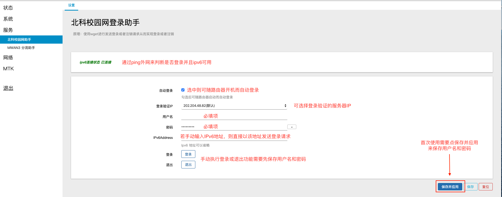

# luci-app-ustb-net
- openwrt 北科校园网登录助手

- 使用教程

    

- 编译

    ```bash
    #进入OpenWRT/LEDE源码package目录
    cd package
    #克隆插件源码
    git clone https://github.com/iz4iz4/luci-app-ustb-net.git
    #返回上一层目录
    cd ..
    #配置
    make menuconfig
    #在luci->application选中插件,编译
    #单独编译
    make package/luci-app-ustb-net/compile V=99
    ```

    